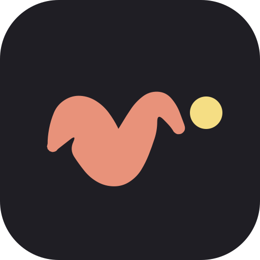
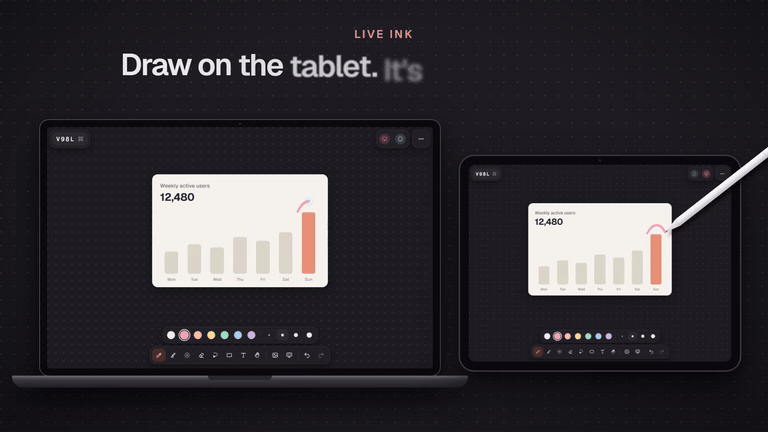

# temp canvas

A private, temporary infinite canvas for up to five people. Share your screen from the PC and draw
on a tablet (Apple Pencil, S Pen): the ink looks like real handwriting instead of mouse scribbles.

[](https://temp-canvas.vercel.app/promo/temp-canvas.mp4)

▶ [Watch the 20-second tour](https://temp-canvas.vercel.app/promo/temp-canvas.mp4) (with sound), or try it at
[temp-canvas.vercel.app](https://temp-canvas.vercel.app).

- **Private and temporary.** A session is a 4-character code (plus a QR code). There is no database
  and no account: the drawing lives in memory on the relay while someone is connected, and End
  session erases it everywhere.
- **Made for pens.** Pressure-sensitive ink, palm rejection, hold-to-snap shapes, pen-button eraser,
  low-latency canvas. Fingers pan and pinch; two-finger tap undoes.
- **Live together.** Everyone's strokes appear while they are drawn, with coloured cursors. Tap
  someone to follow their view (the PC follows the tablet by default).
- **Tools.** Pen, highlighter, laser pointer, eraser, lasso select, shapes, text, pasted images, and
  screen snapshots from the PC to annotate.
- Light and dark themes; a compact toolbar on phones.

## How it works

```
Browser (Next.js on Vercel)  ⇄  WebSocket  ⇄  Cloudflare Worker  →  Durable Object per code (in memory)
```

- `src/canvas`: the editor (Canvas 2D, [perfect-freehand](https://github.com/steveruizok/perfect-freehand)),
  input routing (pen, touch, mouse) and camera.
- `src/sync`: the relay connection (outbox with acks, batching, reconnects) and the tab's copy in
  `sessionStorage`, so a refresh keeps the drawing.
- `relay/`: the Worker and Durable Object. `RoomCore` (in `relay/src/room.ts`) is the whole room
  state machine, free of Cloudflare APIs and unit tested.
- `src/shared`: the wire protocol and document model, used by both sides.

## Local development

Requirements: Node 20+ and pnpm.

```bash
pnpm install
pnpm dev
```

`pnpm dev` starts the web app on port 3000 and the relay (`wrangler dev`) on port 8787, both on your
LAN. Open http://localhost:3000 on the PC, start a session, and scan the QR code with the tablet: it
points at the PC's LAN address. On Windows, allow Node.js and `workerd` through the firewall on
private networks.

```bash
pnpm test        # unit tests (vitest)
pnpm typecheck   # app and relay
pnpm lint
```

## Deploy

1. **Relay (Cloudflare, free plan works).** Set `ALLOWED_ORIGINS` in `relay/wrangler.jsonc` to the
   site's origin (comma-separated; `*` matches one host label, e.g. `https://temp-canvas-*.vercel.app`),
   then run `pnpm deploy:relay`.
2. **App (Vercel).** Set `NEXT_PUBLIC_RELAY_URL` to the relay's `wss://` URL (see `.env.example`) and
   deploy.

## Promo video

`video/` is the product video: a separate [Remotion](https://www.remotion.dev) project, where the
video is React code and the music is composed by a small synthesizer in code, cut to the same beat
(see [video/README.md](video/README.md)). The home screen plays a web copy from `public/promo/`.

## Limits

5 people per session, 20,000 shapes, 4 MB per image and 32 MB of images per session. A session
closes after 3 hours without activity, or a minute after everyone has left.
